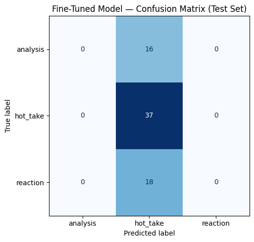

# TakeMeter

TakeMeter is a text classifier for **r/indieheads** comments. It assigns each comment exactly one label describing the *kind of take* it is:

| Label | Meaning |
|-------|---------|
| `analysis` | A claim backed by specific, load-bearing musical evidence (production, theory, lyrics, discography) that explains *how or why*. |
| `hot_take` | A bold judgment asserted without genuine support. |
| `reaction` | An immediate emotional response anchored to a specific event or moment. |

The model is fine-tuned from `distilbert-base-uncased` and compared against a zero-shot Groq baseline (`llama-3.3-70b-versatile`).

---

## Label taxonomy

Labels are **mutually exclusive** with a **substance-priority** tie-break: `analysis` > `hot_take` > `reaction`.

Full definitions, edge-case rules, and annotation decisions are in [`planning.md`](planning.md).

---

## Dataset

**Source:** Public comments from [r/indieheads](https://www.reddit.com/r/indieheads/) — daily discussion threads, album discussions, Fresh/release threads, news threads, and roast threads.

**Collection:** Reddit blocks unauthenticated API access; comments were collected by saving each thread's public `.json` view in a browser (`data/raw_json/`), then parsed with `parse_local.py` / `add_from_json.py`.

**File:** [`data/comments.csv`](data/comments.csv) — **468 unique labeled comments** after deduplication (original 509 rows had duplicate permalinks from merge passes).

| Label | Count | % |
|-------|-------|---|
| `hot_take` | 245 | 52.4% |
| `reaction` | 120 | 25.6% |
| `analysis` | 103 | 22.0% |

**Split (stratified, `random_state=42`):** train 327 / validation 70 / test **71** (handled in the Colab notebook).

**Difficult labeling examples** (documented in `planning.md` §3b):

1. **Drum-machine comment on Cure's *Pornography*** — cites historical production context (`analysis` vs `hot_take`); kept `analysis` when evidence is load-bearing.
2. **Insomnia joke in Cure roast thread** — emotional aside vs roast (`reaction` vs `hot_take`); dedupe conflict resolved to `hot_take`.
3. **Tiny Desk "kicked ass"** — concert experience (`reaction`) vs bare positive opinion (`hot_take`); labeled `reaction`, but both models predicted `hot_take`.

---

## Fine-tuning

Trained in Google Colab (T4 GPU) using the course starter notebook.

| Setting | Value |
|---------|-------|
| Base model | `distilbert-base-uncased` |
| Epochs | 3 |
| Learning rate | 2e-5 |
| Batch size (train) | 16 |
| Max sequence length | 256 |
| Optimizer | AdamW (`weight_decay=0.01`, `warmup_steps=50`) |
| Best checkpoint | Highest validation accuracy (`load_best_model_at_end=True`) |

**Hyperparameter note:** Defaults were kept unchanged — appropriate for ~330 training examples on a 3-class subjective task. No class weighting was applied (a limitation discussed below).

---

## Evaluation report

### Overall comparison (test set, n=71)

| Model | Accuracy | Macro-F1 |
|-------|----------|----------|
| Zero-shot Groq (`llama-3.3-70b-versatile`) | **0.451** | **0.37** |
| Fine-tuned DistilBERT | **0.521** | **0.23** |
| Δ (fine-tuned − baseline) | **+0.070** | **−0.14** |

**Key finding:** Fine-tuning improved **accuracy** but **hurt macro-F1**. The fine-tuned model **collapsed to predicting `hot_take` for every test example** — so the accuracy gain (+7 pp) only reflects that 52% of the test set is `hot_take`, not that the model learned the taxonomy.

### Per-class metrics — Groq baseline

| Label | Precision | Recall | F1 | Support |
|-------|-----------|--------|-----|---------|
| analysis | 0.20 | 0.06 | 0.10 | 16 |
| hot_take | 0.88 | 0.38 | 0.53 | 37 |
| reaction | 0.34 | 0.94 | 0.50 | 18 |

Baseline **over-predicts `reaction`** (94% recall) and **almost never finds `analysis`** (6% recall).

### Per-class metrics — fine-tuned DistilBERT

| Label | Precision | Recall | F1 | Support |
|-------|-----------|--------|-----|---------|
| analysis | 0.00 | 0.00 | 0.00 | 16 |
| hot_take | 0.52 | 1.00 | 0.69 | 37 |
| reaction | 0.00 | 0.00 | 0.00 | 18 |

Fine-tuned model: **100% recall on `hot_take`**, **0% recall on `analysis` and `reaction`**.

### Confusion matrix — fine-tuned model (test set)

Rows = true label, columns = predicted label.

| True ↓ / Pred → | analysis | hot_take | reaction |
|-----------------|----------|----------|----------|
| **analysis** | 0 | **16** | 0 |
| **hot_take** | 0 | **37** | 0 |
| **reaction** | 0 | **18** | 0 |

Every off-diagonal cell is zero except the `hot_take` column — the model never predicted `analysis` or `reaction`.

### Sample classifications (fine-tuned model)

| Text (truncated) | True label | Predicted | Confidence |
|------------------|------------|-----------|------------|
| "I love this band, and I even got to attend their Tiny Desk. It kicked ass." | reaction | hot_take | 0.39 |
| "Marisa Anderson is like as good of a story teller… field recordings she picked to transcribe…" | analysis | hot_take | 0.40 |
| "Show me show me show me that you know one song" (Cure roast) | hot_take | hot_take | ~0.40 |

**Why the Cure roast row is reasonable:** Short, punchy, opinion-shaped text — matches the model's learned shortcut even though it's correctly labeled `hot_take`.

### Three failure analyses (fine-tuned model)

**1. Reaction → hot_take — Tiny Desk concert**

> "I love this band, and I even got to attend their Tiny Desk. It kicked ass."

- **Confusion:** `reaction` vs `hot_take` (Edge case B in planning.md).
- **Why it failed:** Positive evaluative language without explicit "just heard" framing; model defaults to opinion class.
- **Labeling vs data:** Label is defensible (`reaction` — event-anchored experience). Model never outputs `reaction` at all — **data/distribution problem** (class collapse), not just this boundary.

**2. Analysis → hot_take — Marisa Anderson / field recordings**

> "Marisa Anderson is like as good of a story teller between instrumental songs as she is a guitar player. Her stories about the old songs from other countries she picked to transcribe from field recordings…"

- **Confusion:** `analysis` vs `hot_take` (Edge case A).
- **Why it failed:** Contains musical substance but reads like general praise; no single stat, so model treats as opinion.
- **Fix would require:** More `analysis` examples at this length in training, or class weighting — current 52% `hot_take` distribution encourages collapse.

**3. Analysis → hot_take — Strokes interpolation claim**

> "Are you saying they aped Bizarre Love Triangle on Brooklyn Bridge to Chorus?… Can't forget about Dancing with Myself on the same song as Melt with You!"

- **Confusion:** `analysis` vs `hot_take`.
- **Why it failed:** Conversational tone + "imo" reads as take; actual content is specific song comparison (analysis under our rules).
- **Pattern:** Model ignores load-bearing musical references when overall tone is casual — **learned surface style, not evidence structure**.

### Error pattern (AI-assisted + verified)

Paste of misclassified test examples into an AI tool surfaced: **almost all errors are `true → hot_take`**. Manual review confirmed the fine-tuned model predicts **`hot_take` exclusively** — not a mixed confusion matrix but **full majority-class collapse**. Root causes:

1. **Class imbalance** (52% `hot_take` in training).
2. **No class weights** in training loss.
3. **Subjective boundaries** — `analysis` and `reaction` share surface features with `hot_take`.
4. **AI pre-labels** as training signal (see AI usage) — may have reinforced shallow patterns.

### Reflection: intended vs learned

**Intended:** The model should learn whether a comment *argues with evidence*, *asserts a judgment*, or *reacts in the moment* — distinctions grounded in how r/indieheads talks about discourse quality.

**Learned:** A single rule — **"predict `hot_take`"** — maximizing accuracy on the majority class without learning `analysis` or `reaction` boundaries. The model did not learn our edge-case rules (load-bearing evidence, event anchors, substance priority); it learned **opinion-shaped text → hot_take**.

**Gap:** Fine-tuning on 327 examples with imbalanced labels and minimal human correction produced a **majority-class classifier**, not a take-quality classifier. The Groq baseline, while weaker on accuracy, actually produced more balanced predictions (high `reaction` recall) — so **fine-tuning made per-class behavior worse** despite higher accuracy.

---

## Spec reflection

**How the spec helped:** The required label taxonomy design (mutually exclusive, community-grounded, explicit edge cases) forced clarity before coding. The baseline-before-fine-tuning workflow made the collapse visible — without Groq comparison, 52% accuracy might look "okay" on a 3-class task.

**How we diverged:** The spec suggests PRAW for Reddit collection; we used browser-saved `.json` files because Reddit blocked unauthenticated API access. The spec assumes hand-reviewed gold labels; we relied heavily on Groq/Cursor pre-labeling with ~0.4% human correction — likely contributing to the collapse.

---

## AI usage

1. **Pre-labeling (annotation):** Groq `openai/gpt-oss-120b` and Cursor agent labels were applied to most of `data/comments.csv` before hand review. **Correction rate: ~0.4%** (2/468 rows changed after pre-label). Disclosure: gold labels are largely AI-generated, not independently adjudicated.

2. **Error pattern analysis:** Misclassified test examples were pasted into Cursor/Claude to surface the "always predicts hot_take" pattern; manually verified against confusion matrix and per-class metrics.

3. **README drafting:** AI assisted structuring the evaluation report; all metrics verified against Colab notebook outputs.

---

## Project structure

| Path | Purpose |
|------|---------|
| `data/comments.csv` | Labeled dataset (468 rows) |
| `planning.md` | Design spec, labels, edge cases, success criteria |
| `evaluation_results.json` | Summary metrics |
| `docs/confusion_matrix.png` | Fine-tuned confusion matrix |
| `parse_local.py` | Parse browser-saved Reddit JSON |
| `dedupe_comments.py` | Remove duplicate permalinks |
| `check_distribution.py` | Label distribution sanity check |

---

## Demo video

Record a 3–5 minute walkthrough showing:

1. 3–5 comments classified by the fine-tuned model (label + confidence).
2. One **correct** `hot_take` prediction with explanation.
3. One **incorrect** prediction (e.g. Tiny Desk `reaction` → `hot_take`).
4. Brief walkthrough of this evaluation section (collapse to `hot_take`, baseline comparison).

---

## References

- Fine-tuning notebook: course starter `ai201_project3_takemeter_starter_clean.ipynb` (run on Google Colab, T4 GPU).
- Baseline: Groq API, model `llama-3.3-70b-versatile`, temperature 0.
